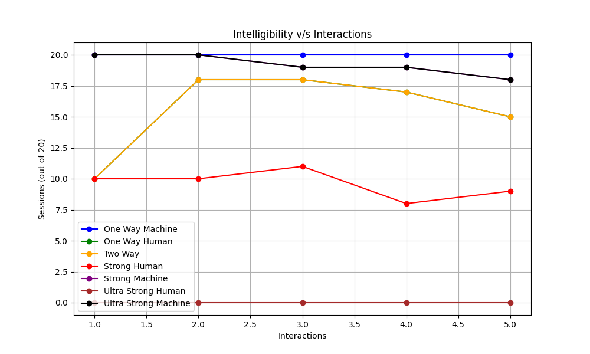

# interact
Official Implementation for the intelligibility protocol (PXP).
(As discussed in the paper, this is a special case because the Human will never revise it's beliefs.)

[](https://arxiv.org/abs/TBD)

### Reproducing our results
To reproduce our results, you can run the following command:
```bash
python src/interact.py --num_iter=4 --num_ailments=5
```
This will output the counts of one-way and two-way intelligible sessions, create a tags.txt file of the actual tags exchanged between the two agents and also save the D, M and C (from paper section ...) to the `results/` folder.
You can also change the `num_iter` field to reproduce Figure x in the paper.



### Data
We provide our own dataset consisting of Xrays, over 3, 5 and 7 ailments.
It consists of static reports which are summaries of actual ground truth human reports (we used the `summarize` function from `src/utils.py` to generate these summaries).
In general the code allows for interaction between such static human feedback and an LLM (interfaced by the machine).
We might add support for a real-time Command Line based interaction later.
So, for the model to work with custom data, you would need some form of static human feedback, stored in data as a CSV.