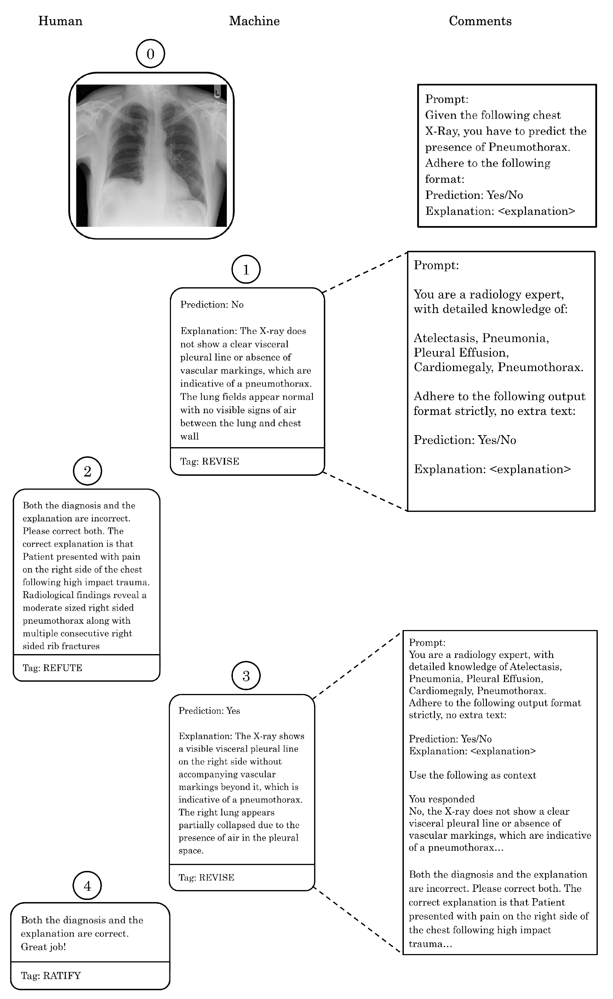
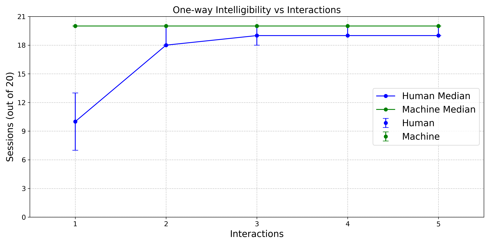

# interact
Official Implementation for the intelligibility protocol PXP
(As discussed in the paper, this is a special case because the Human will never revise it's beliefs).

[](https://arxiv.org/abs/TBD)


This is an example interaction generated by using the PXP protocol and our implementation.


### Installation
We have very minimal dependencies, and you can install them using the following command:
```bash
pip install -r requirements.txt
```
You might want to create a virtual environment (or use conda) to avoid conflicts with your system packages.
We use **python3.9.18** for all experiments.

### Reproducing our results
To reproduce our RAD results, you can run the following command:
```bash
python src/interact.py --num_iter=5
```
This will output the counts of one-way and two-way intelligible sessions, create a tags.txt file of the actual tags exchanged between the two agents and also save the D (`data.pkl`), M (`messages.pkl`) and C (`context.pkl`) (from Procedure 1 in the paper) to the `results/` folder.
To reproduce the trend in Figure 3 from the paper, we ran the above command 5 times and manually extracted how many one-way intelligible sessions (upto an interaction limit) were generated per agent.
Reproducing the DRUG results requires an expert and so the outcome may be stochastic.



### Data
We provide our own dataset consisting of Xrays, over 5 ailments.
It consists of static reports which are summaries of actual ground truth human reports (we used the `summarize` function from `src/utils.py` to generate these summaries).
In general the code allows for interaction between such static human feedback and an LLM (interfaced by the machine).
So, for the model to work with custom data, you would need some form of static human feedback, stored in data as a CSV.

### Real-time feedback
With the DRUG task, one can create an analogous real-time feedback system, using the command line and a real expert human for feedback.


### Citation
If you find this code useful, please consider citing our preprint:
```
@article{pxp_implementation,
  title={Implementation and Application of an Intelligibility Protocol for Interaction with an LLM},
  author={tbd},
  journal={tbd},
  year={tbd}
}
```